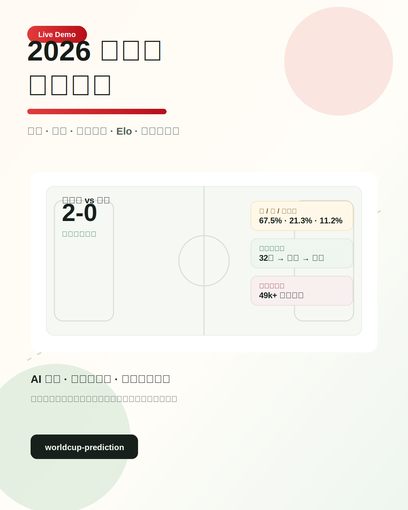
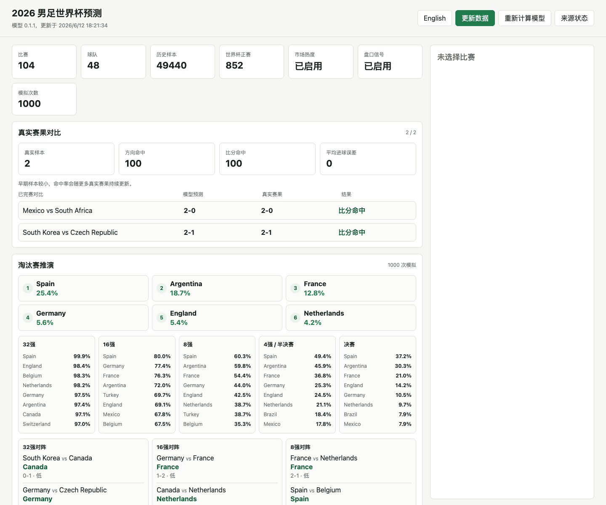

# 2026 男足世界杯预测模型

<p align="center">
  <a href="https://worldcup-prediction-peur.onrender.com"></a>
  
  
  
</p>

<p align="center">
  <strong>中文界面</strong>
</p>



## 在线体验

访问地址：**[https://worldcup-prediction-peur.onrender.com](https://worldcup-prediction-peur.onrender.com)**

> Render 免费实例长时间无人访问会休眠，首次打开可能需要等待几十秒。

## 项目亮点

- **不需要 API Key**：后端自动抓取公开赛程、国际比赛历史、世界杯历史 CSV、FIFA 排名页面、义乌/外贸热度和公开赔率页面。
- **可解释预测模型**：Elo、近期状态、进攻/防守强度、世界杯历史、东道主/主大陆因素、义乌市场热度和公开盘口信号共同进入模型。
- **完整赛事推演**：展示 32 强、16 强、8 强、4 强/半决赛、决赛对阵预测和冠军概率。
- **真实赛果对比**：已完赛的真实比分会和模型预测逐场对比，自动计算方向命中率、精确比分命中率和进球误差。
- **全中文界面**：访问者打开即可看到中文筛选、赛果、来源和模型解释。
- **可公开部署**：FastAPI + 原生 HTML/CSS/JS，已配置 Docker 和 Render Blueprint。

## 程序界面



## 模型预测能力

当前已接入 2026 世界杯已完赛真实比分，页面会自动展示模型预测和真实赛果对比：

| 比赛 | 模型预测 | 真实赛果 | 结果 |
| --- | ---: | ---: | --- |
| 墨西哥 vs 南非 | 2-0 | 2-0 | 精确比分命中 |
| 韩国 vs 捷克 | 2-1 | 2-1 | 精确比分命中 |
| 加拿大 vs 波黑 | 3-0 | 1-1 | 未命中 |
| 美国 vs 巴拉圭 | 1-2 | 4-1 | 未命中 |

当前样本指标：

- 方向命中：随实时赛果自动更新
- 精确比分命中：随实时赛果自动更新
- 平均进球误差：随实时赛果自动更新

说明：这是早期样本，命中率会随着更多真实赛果接入持续更新。页面会保留每场真实赛果来源，避免只展示口号。

真实赛果来源：

- 已完赛比分：ESPN 世界杯实时比分接口。
- 墨西哥 2-0 南非: [AP live report](https://apnews.com/live/world-cup-mexico-south-africa-2026-updates)
- 韩国 2-1 捷克: [Al Jazeera report](https://www.aljazeera.com/sports/2026/6/12/south-korea-vs-czechia-world-cup-2026-oh-hyeon-gyu-hwang-in-beom)

## 模型方法

模型是可解释规则模型，不使用付费数据或隐藏 API Key。当前版本参考高盛公开世界杯预测思路，把长期实力、正式比赛攻防、世界杯历史、主办国/主大陆和市场信号组合后进行模拟：

- 历史国际比赛结果计算 Elo。
- 最近 10 场计算近期状态，最近 20 场估计攻防强度。
- 正式比赛近 10 场进攻/失球、近 5 场正式比赛防守、世界杯正赛历史表现、世界杯阶段/淘汰赛经验、主大陆因素进入修正。
- Poisson 进球分布生成比分矩阵和胜/平/负概率。
- 美国、墨西哥、加拿大作为东道主获得小幅主办国修正。
- 义乌/外贸/世界杯周边订单相关页面只作为市场热度辅助信号，最多带来约 25 Elo 的相对修正。
- 公开博彩盘口页面只作为赔率市场辅助信号，最多带来约 35 Elo 的相对修正；不构成投注建议。
- Render 免费实例默认用 `1000` 次模拟保证可在线完成；本地默认 `50000` 次，可通过 `TOURNAMENT_SIMULATIONS` 调整。

## 数据源

默认公开来源包括：

- openfootball 的 2026 World Cup JSON 赛程。
- martj42/international_results 的国际比赛历史 CSV。
- 本地 `WorldCupMatches.csv` 历届世界杯正赛数据。
- FIFA 男足世界排名页面。
- 小商品指数网、商务预报、中国商品网、公开搜索结果页中的义乌世界杯订单相关文本。
- OddsJet 多地区页面和 Compare.bet 世界杯冠军赔率页，用于公开盘口市场信号。
- ESPN 世界杯实时比分接口，以及 `data/actual_results.json` 中维护的备用真实比分和来源链接。

抓取结果、模型输出和来源状态会缓存在 `data/` 目录。仓库保留一份公开缓存，保证云端首次启动就能展示完整预测；用户可在页面上点击“更新数据并重算”联网刷新公开数据源并完整重建模型，也可点击“重新计算模型”使用本地缓存重算预测。

## 本地运行

```bash
python3 -m venv .venv
source .venv/bin/activate
pip install -r requirements.txt
uvicorn app.main:app --reload
```

打开 `http://127.0.0.1:8000`。

## API

- `POST /api/update`：后台联网刷新公开数据源、重建模型、同步已完赛比分并刷新命中统计。
- `POST /api/recalculate`：使用本地缓存后台重新计算模型。
- `GET /api/status`：查看更新时间、来源数量、后台任务状态。
- `GET /api/matches`：获取比赛列表、淘汰赛推演、真实赛果对比。
- `GET /api/matches/{id}`：获取单场详细预测和解释。
- `GET /api/sources`：查看来源状态。

## 测试

```bash
pytest
node --check static/app.js
```

## 部署

仓库包含 `Dockerfile` 和 `render.yaml`，可以直接用 Render Blueprint 部署。当前线上环境：

- Service: `worldcup-prediction`
- URL: [https://worldcup-prediction-peur.onrender.com](https://worldcup-prediction-peur.onrender.com)
- Runtime: Docker / FastAPI / Uvicorn

---

本项目用于分析和娱乐，不构成投注或投资建议。
